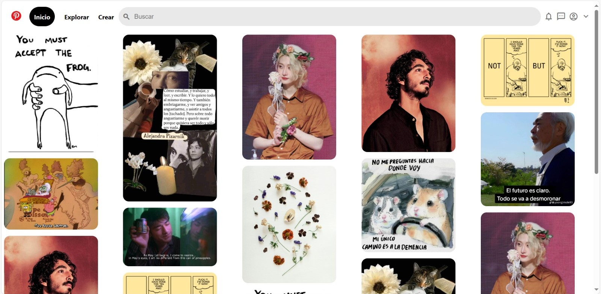

Markdown
# Clon de Pinterest con HTML y CSS

Este proyecto es un clon de la interfaz de usuario de Pinterest, creado puramente con HTML5 y CSS3.

Se enfoca en replicar la apariencia visual de Pinterest, ofreciendo una experiencia de navegación similar con un diseño responsive y funcionalidades básicas.

### Características

* **Diseño responsive:** Adaptable a diferentes tamaños de pantalla, para una experiencia de usuario óptima en dispositivos móviles y de escritorio.
* **Interfaz de usuario intuitiva:** Inspirada en Pinterest, con una navegación fácil y accesible.
* **Interacciones dinámicas:** Efectos visuales para elementos interactivos como botones y enlaces. 
*  **Iconografía y estilos modernos:** Uso de la biblioteca de íconos de Material Design y estilos CSS modernos, para una apariencia cool.

### Tecnologías utilizadas
+ **HTML5:** Para la esctructura básica del sitio.
+ **CSS3:** Para el diseño y el estilo, incluyendo _flexbox_ para un diseño responsivo y efectos de _hover_.
+ **Google Fonts:** Para fuentes personalizadas.

### Vista previa del proyecto

### Contacto
Si te gustaría invirtarme a colaborar en un proyecto, escríbeme por [LinkedIn](www.linkedin.com/in/aslebarr94)!

